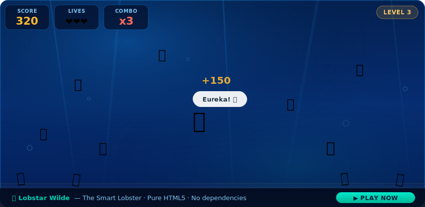

# 🦞 Lobstar Wilde — The Smart Lobster

> A browser-based arcade game about the ocean's most brilliant crustacean.  
> No frameworks. No dependencies. Pure HTML, CSS & JavaScript — open and play.


<p align="center">
  
</p>

---

## 🎮 Play Now

Just open `Lobstar-game.html` in any modern browser. That's it.

```bash
git clone https://github.com/codexaktobe-cmd/lobstarwildegame.git
cd lobstarwildegame
open Lobstar-game.html   # macOS
start Lobstar-game.html  # Windows
xdg-open Lobstar-game.html  # Linux
```

Or host it instantly on GitHub Pages, Netlify, or any static file server.

---

## 🌊 What is This?

**Lobstar Wilde** is a single-file web game set in the deep ocean. You control a genius lobster who must collect seafood while dodging hungry sharks and jellyfish. The game teaches real scientific facts about lobsters between rounds, blending entertainment with education.

The lobster follows your mouse cursor around the arena. Click floating food items to collect them — but watch out for enemies crossing the screen. Collect multiple items in quick succession to build a **combo multiplier** and rack up a massive score.

---

## ✨ Features

| Feature | Description |
|---|---|
| 🖱 Mouse & touch controls | Works on desktop and mobile |
| 🔥 Combo system | Chain collections for x2–x8 score multipliers |
| 📈 Level progression | Difficulty scales with your XP bar |
| 💬 Thought bubbles | Lobstar Wilde reacts: "Eureka!", "QED!", "Hypothesis!" |
| 🧠 Science facts | 8 rotating real facts about lobster intelligence |
| 🌊 Animated ocean | Light rays, bubbles, seaweed, sand floor |
| ❤️ Lives system | 3 lives with brief invincibility after each hit |
| 🏆 High score | Best score persists during your session |

---

## 🕹 How to Play

1. **Move** your mouse (or finger on mobile) to guide Lobstar Wilde
2. **Click food** items floating in the water to collect them — shrimp 🦐, fish 🐟, crab 🦀, squid 🦑, oysters 🦪 and more
3. **Avoid enemies** — sharks 🦈 and jellyfish 🪼 cross the screen horizontally
4. **Build combos** — collecting food quickly within 2.8 seconds multiplies your points
5. **Level up** — fill the XP bar to increase your level and unlock faster, more intense gameplay
6. **Survive** with your 3 lives — after each hit you have 1.6 seconds of invincibility

### Scoring

```
Base points per item = 10 × current level × combo multiplier
```

| Combo | Multiplier |
|-------|-----------|
| 1 item | ×1 |
| 2 items | ×2 |
| 3 items | ×3 |
| … | … |
| 8+ items | ×8 (max) |

The combo resets if you wait more than 2.8 seconds between collections.

---

## 📁 Project Structure

```
lobstarwildegame/
└── Lobstar-game.html   # The entire game — one self-contained file
└── README.md                 # This file
```

The whole game lives in a single HTML file (~330 lines). No build step, no package manager, no external assets required. The only external resource is the Google Fonts stylesheet for **Fredoka One** and **Nunito** typefaces — the game still works without them, just with system fonts.

---

## 🛠 Technical Details

The game is built with vanilla HTML5, CSS3, and JavaScript — no frameworks or libraries.

### Architecture

- **Game loop** — `requestAnimationFrame` for smooth 60fps rendering
- **Entity system** — Foods, enemies, bubbles, and particles are lightweight JS objects with DOM elements
- **Physics** — Lerp-based (linear interpolation) smooth lobster movement following the cursor
- **Collision** — Simple AABB (axis-aligned bounding box) proximity checks between lobster and enemies
- **Progression** — XP thresholds grow by 1.4× per level; enemy speed and spawn rate scale with level

### Key Variables

```javascript
// Lobster follows mouse with smooth lerp
lx += (mx - lx) * 0.075;   // 7.5% of distance per frame
ly += (my - ly) * 0.075;

// Points formula
const pts = 10 * level * combo;

// Enemy speed scales with level
const speed = (0.018 + level * 0.006) * direction;

// XP goal grows each level
xpGoal = Math.floor(xpGoal * 1.4);   // starts at 100
```

### Visual Design

- **Color palette** — Deep ocean blues (`#021a3a`, `#04306b`), teal accents (`#00d4b4`), amber highlights (`#ffb830`)
- **Typography** — Fredoka One (display / scores) + Nunito (UI / body text) from Google Fonts
- **CSS animations** — Light ray sway, seaweed bob, food bounce, bubble rise, score pop, particle burst
- **Dark ocean atmosphere** — Radial gradient layering + animated SVG-free decorative elements

---

## 🧠 Lobster Facts in the Game

The science ticker at the bottom rotates through 8 real facts:

1. Lobsters are **biologically immortal** — they don't age conventionally and can live 100+ years
2. They use antennae to detect chemical signals and build **mental maps** of their territory
3. Lobsters can **navigate mazes** and remember solutions — demonstrating problem-solving intelligence
4. They've existed for over **480 million years**, surviving five mass extinctions
5. Lobsters can be blue, yellow, albino, or **calico** (one in 50 million!)
6. They can **regrow lost claws**, legs, and antennae — built-in self-repair
7. Lobsters communicate by releasing **chemical signals** and recognize individual neighbors
8. They have taste receptors on their **legs and feet** — they taste what they walk on

---

## 🚀 Deployment

### GitHub Pages

1. Push the repo to GitHub
2. Go to **Settings → Pages**
3. Set source to `main` branch, root folder
4. Your game is live at `https://codexaktobe-cmd.github.io/lobstarwildegame/Lobstar-game.html`

### Netlify / Vercel

Drag and drop the folder into Netlify Drop or connect your GitHub repo. Works instantly with zero configuration.

### Embed in a Website

```html
<iframe
  src="Lobstar-game.html"
  width="100%"
  height="700"
  frameborder="0"
  style="border-radius: 16px;"
></iframe>
```

---

## 🤝 Contributing

Contributions are welcome! Ideas for improvement:

- [ ] Local storage high score persistence across sessions
- [ ] Sound effects and background ocean ambience
- [ ] Power-ups: speed boost, invincibility shield, magnet for food
- [ ] Mobile on-screen joystick alternative
- [ ] More enemy types (electric eels, anglerfish)
- [ ] Leaderboard with name entry
- [ ] Difficulty presets (Easy / Normal / Hard)

To contribute:

```bash
git fork https://github.com/codexaktobe-cmd/lobstarwildegame.git
git checkout -b feature/your-feature-name
# make your changes in Lobstar-game.html
git commit -m "Add: your feature description"
git push origin feature/your-feature-name
# open a Pull Request
```

---

## 📄 License

MIT — free to use, modify, and distribute. See [LICENSE](LICENSE) for details.

---

## 👤 Author

Built with 🦞 and a healthy respect for crustacean intelligence.

> *"Lobsters are biologically immortal. Your high score, unfortunately, is not."*  
> — Lobstar Wilde
